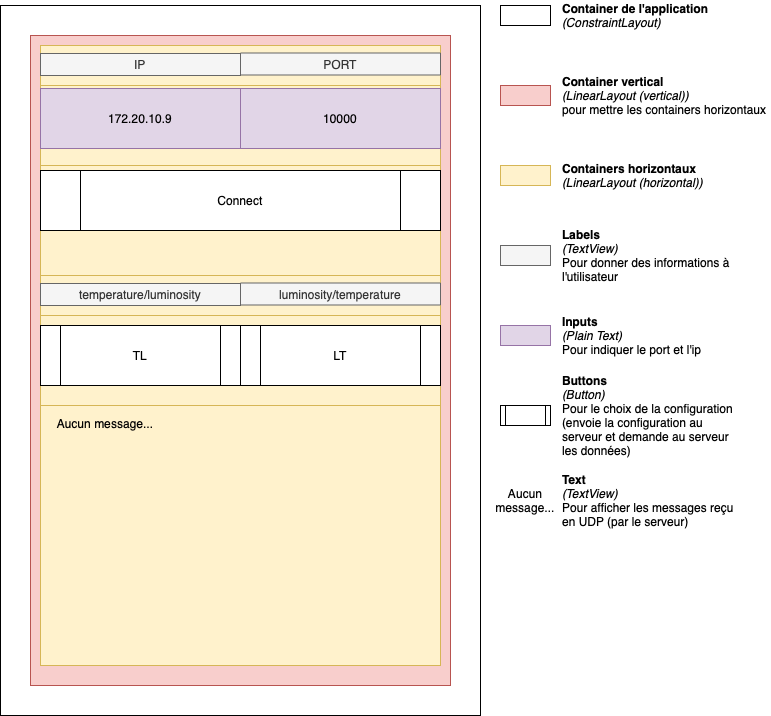
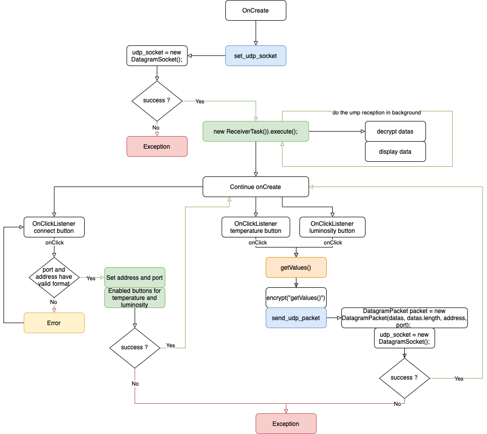
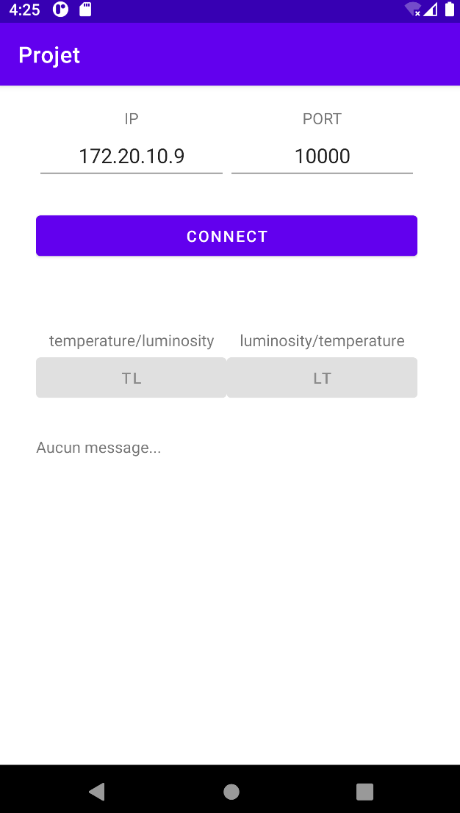

# Application Android (Java) - Equipe 16

# Introduction

Le code est fonctionnel et commenté. Les noms des variables et des fonctions sont explicites pour augmenter la compréhension de celui-ci.

Nous n'avons pas suivi d'architecture spéciale pour ce projet, nous avons simplement construit une interface homme-machine propre avec des linear layouts ainsi qu'un code **`MainActivity`** pour gérer cette interface.

# Architecture

## Interface Homme Machine

## Programme Java

### Déroulement

Ce schéma présente le fonctionnement de notre application Android. Résumé du déroulement dans un cas sans problème :

1. L'application tente de créer un datagram socket pour lancer un processus en arrière-plan qui fonctionne en tant que **`réception`**
    
    *→ en cas de réception d'un paquet UDP, il est décrypté et affiché sur l'application*
    
2. L'application propose deux champs éditables l'un pour une **`adresse ip`** et l'autre pour un **`port`**
    
    → lors du clique sur le bouton **`connect`**, l'application tente de se connecter au serveur renseigné dans les champs éditables → vérification par **`ReGex`**
    
3. Une fois connecté, l'utilisateur peut cliquer sur **`deux boutons`**, le fait de cliquer sur un bouton effectue ces opérations :
    1. Envoie la configuration **`(message crypté)`** à la passerelle connectée via UDP
        
        → cryptage de TL ou LT (la configuration)
        
    2. Reçoit les données dans l'ordre d'affichage demandé 
    

### Conception

- app
    - java
        - **MainActivity**
            
            → code de l'application voir **#Déroulement**
            
            - *Encryption*
                
                → utilisé pour crypter les données envoyées et décrypter les données reçues
                
            - *ReceiverTask*
                
                → utilisé pour réceptionner les paquet UDP (en arrière-plan)